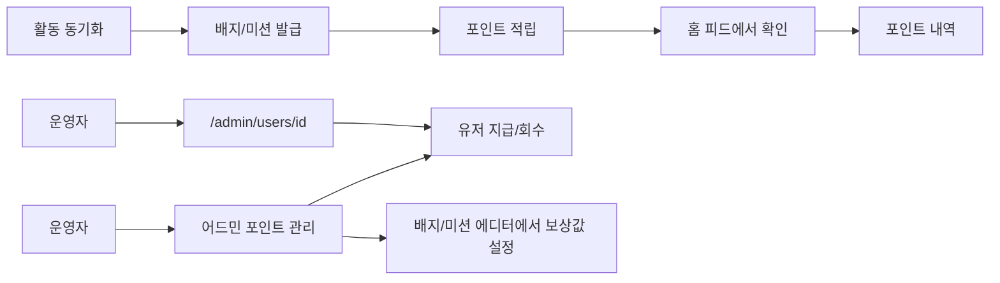

# JAM! 잼 포인트 시스템 — 화면 흐름 (1a단계)

> ✅ **1a단계 구현 완료 (2026-07-23)** — 흐름 A(유저: 프로필 잔액·포인트 내역·배지 상세 안내)와 흐름 B(운영자: `/admin/points` 대시보드·정합성 배너·유저 지급/회수 공용 폼·배지/미션 에디터 확장) 모두 코드 반영됨. 구현 상세: `PRD/SERVICE_OPERATIONS_20260723_1501.md`.
> 최종 업데이트: 2026-07-23
> 전제: [POINT_SYSTEM_OBJECT_MODEL.md](POINT_SYSTEM_OBJECT_MODEL.md)의 **1a단계**(포인트 체계만 — 잔액·내역·발행 장부, 배지·미션 적립 연동)를 기준으로 한다. **포인트 상점(포인트로 뭔가를 사는 화면)은 1b단계로 미룸 — 이번 흐름엔 없음.** 유저 간 거래(플리마켓/물물교환) 흐름은 2단계로 유보 — 마찬가지로 이 문서에 없음.
> 이 문서는 화면 디자인이 아니라 "어느 화면에서 무엇을 할 수 있고 어디로 이동하는지"를 정하는 문서다. 실제 UI 톤앤매너는 다음 단계(서피스)에서 결정한다.
> 이번 라운드는 **적립과 잔액 확인만 있고 소비는 없는 상태**로 잠깐 운영된다 — 포인트 상점이 나오기 전까진 포인트는 그냥 쌓이기만 한다. 의도된 선택.

---

## 흐름 A — 유저: 활동 후 포인트가 들어온 걸 확인한다

**상황:** 활동을 동기화한 유저가 오늘 뭘 얻었는지 피드에서 확인하려 한다.

```
홈 피드
- 배지 발급 카드 → 배지 상세
  [카드 안에 배지가 포인트를 포함하면 "+N P" 같이 표시]
- 미션 완료 카드 → 미션 상세
  [보상이 포인트면 "+N P" 표시 — 지금도 이미 표시 중, 이제 실제 적립과 연결]

배지 상세
- [배지에 포인트가 붙어 있으면 "이 배지는 N 포인트를 함께 드렸어요" 안내 문구]

내 프로필 (기존 /profile — 본인만 보는 화면)
[ 이메일 바로 아래에 현재 포인트 잔액 상시 노출 ] → 포인트 내역
※ 이 잔액 표시는 **본인 프로필에서만** 나타난다.

타인 프로필 (기존 /[username] — 다른 유저가 보는 화면)
[ 포인트 잔액 표시 없음 — 이메일과 마찬가지로 비공개 정보 취급 ]

포인트 내역 (신규 화면 — 내 프로필 하위, 본인만 진입 가능)
[ 현재 잔액 크게 표시 ]
[ 최근 내역 목록: 이유 · 날짜 · 금액(+/-) ]
- 목록 항목 → 관련 배지/미션 상세로 이동 (해당 항목이 있을 때만)
[ 빈 상태: "아직 쌓인 포인트가 없어요. 활동을 동기화하면 배지와 함께 포인트를 받을 수 있어요" ]
[ 목록 로딩 실패: 에러 안내 + 다시 시도 ]
```

**결정됨:** 포인트 잔액은 내 프로필 화면의 이메일 바로 아래에 상시 노출한다. 타인이 내 프로필(`/[username]`)에 접속했을 때는 이메일과 마찬가지로 노출되지 않는다 — 포인트 잔액을 이메일과 같은 급의 "본인 전용 정보"로 취급.

---

## (추후 기획단계로 유보)

포인트 상점(가방 칸 늘리기 등 "포인트로 뭔가를 사는" 흐름)은 이번 라운드에 만들지 않는다. 포인트 상점을 설계할 때 별도 문서로 다룬다.

---

## 흐름 B — 운영자: 포인트 경제를 확인하고 조작한다

**상황:** 운영자가 포인트가 잘 돌아가는지 확인하고, 필요하면 특정 유저에게 직접 지급·회수한다.

**지급/회수 조작은 두 곳에서 모두 가능해야 한다** — CS 응대 중엔 유저 상세에서 바로, 전체 현황을 볼 땐 포인트 관리에서 바로. 같은 조작을 두 곳에 노출하는 것이므로 실행 로직은 하나를 공유하고 진입점만 둘이다.

```
어드민 포인트 관리 (신규, /admin/points)
[ 요약: 총 발행량 · 총 회수량 · 현재 유통량 ]
[ 유저 보유 합계 vs 발행 장부 잔여 — 어긋나면 경고 배너 ]
[ 배지·미션별 발행량 순위 ]
- "유저 검색" → 유저 지급/회수 (아래와 동일 화면)

유저 지급/회수 — ①어드민 포인트 관리에서 유저 검색 후 진입 / ②기존 /admin/users/[id] 화면 안에서 바로 진입, 두 경로 모두 같은 화면으로 이어짐
[ 해당 유저 현재 잔액 ]
[ 최근 내역 목록 ]
- 지급/회수 폼:
  [ 사유 — 아래 목록에서 선택 ]
  [ "기타" 선택 시에만 자유 텍스트 입력란이 나타남 ]
  [ 금액 입력 ]
  → 실행
  [ 큰 금액 입력 시 확인 팝업: "정말 5,000P를 지급하시겠어요?" ]
  → 처리 결과 확인, 화면에 새 내역 반영

배지 에디터 (기존 /admin/badges/[id], 확장)
[ "포인트 보상" 입력 필드 추가 ]

미션 에디터 (기존 /admin/missions, 확장)
[ 보상으로 배지를 고르고, 그 배지에 포인트가 붙어 있으면 ]
[ "이 배지는 발급 시 자동으로 N 포인트도 함께 지급됩니다" 안내 문구 ]
```

**정합성 오류 감지:** "유저 보유 합계"와 "발행 장부로 계산한 값"이 어긋나면 화면 상단에 경고 배너를 띄운다 — 운영자가 매일 이 화면을 열 때 자연스럽게 이상 신호를 보게 하기 위함.

### 지급/회수 사유 목록 (제안)

지급·회수 어느 방향이든 같은 목록에서 고른다(방향은 금액 입력란에서 +/− 또는 별도 버튼으로 결정). 처음 운영에 필요한 최소 세트로 제안:

| 사유 | 보통 쓰이는 방향 |
|---|---|
| CS 보상 (유저 불편·문의 대응) | 지급 |
| 오류 정정 (시스템 오류로 과소/과다 지급된 걸 바로잡음) | 지급 또는 회수 |
| 이벤트/프로모션 지급 | 지급 |
| 어뷰징 적발 회수 | 회수 |
| 과거 데이터 소급 반영 (마이그레이션 등) | 지급 또는 회수 |
| 기타 (자유 입력) | 지급 또는 회수 |

방향을 제한하지 않고 목록 하나로 통일한 이유: "오류 정정"처럼 방향이 상황에 따라 달라지는 사유가 있어서, 사유별로 지급용/회수용 목록을 따로 두면 오히려 헷갈린다.

---

## 전체 흐름 그림 (방향 참고용)



---

## 아직 안 정한 것

없음 — 남아있던 두 질문(포인트 잔액 노출 위치, 지급/회수 사유 목록) 모두 이번 답변으로 정리됨. 지급/회수 사유 목록은 제안값이므로 실제 운영해보며 항목을 늘리거나 줄일 수 있다(카탈로그처럼 어드민이 직접 관리할지, 코드에 고정할지는 개발 단계에서 결정).

이제 1a단계의 개념 모델과 화면 흐름이 모두 정해졌다. 다음은 서피스(실제 UI 형태·톤앤매너)로 넘어가거나, 곧바로 개발 착수를 위한 PRD 정리로 넘어갈 수 있다.
