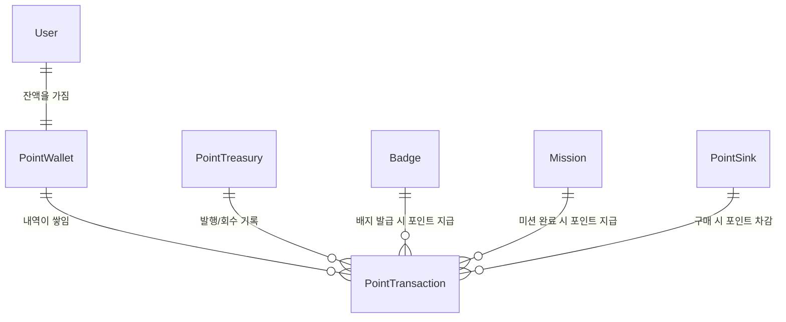
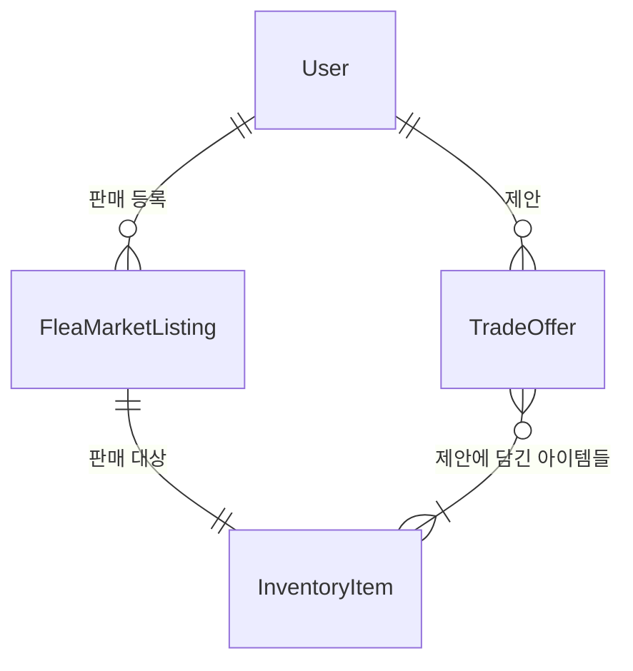
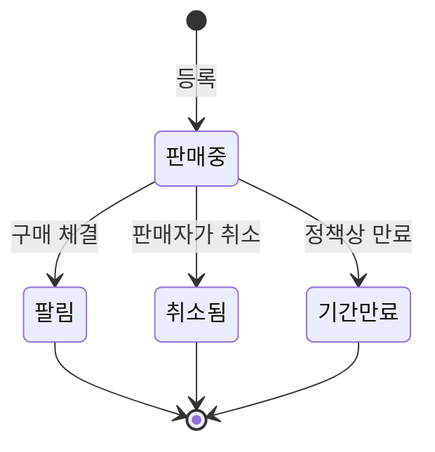

# JAM! 잼 포인트(Point) 시스템 — 객체 모델

> ✅ **1a단계 구현 완료 (2026-07-23)** — PointWallet/PointTransaction/PointTreasury(마이그레이션 045) + award_points RPC + 배지·드랍·미션 적립 연동 + 유저/어드민 화면까지 코드 반영됨. PointSink(1.4, 포인트 상점)와 2단계(유저 간 거래)는 이번 범위 아님(설계만 유지). 구현 상세: `PRD/Phase12_*`, `PRD/SERVICE_OPERATIONS_20260723_1501.md`.
> 최종 업데이트: 2026-07-23
> 이 문서는 화면 디자인이나 DB 설계도가 아니라, "잼 포인트"와 "유저 간 거래"를 서비스가 어떤 단위(객체)로 다룰지에 대한 설계 문서다. 아래 내용 중 구체 수치(적립률, 한도 등)는 아직 가설이고, 실제로 켜보면서 조정이 필요하다.

---

## 0. 왜 이 문서가 필요한가

지금 코드에는 포인트를 실제로 지급하는 로직이 없다. 그런데 화면에는 이미 포인트가 있는 것처럼 보이는 부분이 있다 — 미션 화면과 피드에 "+100P"라고 표시되는 숫자([`missions/page.tsx`](../jam-web/src/app/(main)/missions/page.tsx:19), [`HomeFeedSection.tsx`](../jam-web/src/app/(main)/HomeFeedSection.tsx:92))가 그것이다. 이 숫자는 지금 **아무 지갑에도 쌓이지 않는 장식**이다. 이번 설계의 1차 목표는 이 숫자를 진짜로 모이는 잔액으로 만드는 것이다.

## 0.1 작업 순서

플리마켓(유저 간 매매)은 이번엔 열지 않는다. **먼저 포인트를 어떻게 주고 모으게 할지부터 정하고, 유저 간 거래는 그다음 단계에서 그 위에 얹는다.**

```
1a단계 (이번에 만듦)      1b단계 (다음에 만듦)         2단계 (그다음)
포인트 체계만             포인트 상점(쓰는 곳)          유저끼리 아이템배지를
(잔액·내역·발행 장부,      — PointSink                 사고파는 기능
 배지·미션 적립만 연결)
```

**이번 라운드는 1a만 만든다.** 포인트를 주고 잔액에 쌓이고 내역이 남는 것까지만 구현하고, 그 포인트로 뭔가를 사는 화면(포인트 상점, 1.4의 `PointSink`)은 만들지 않는다 — 다음 라운드에 별도로 다룬다. 즉 이번엔 **적립만 있고 소비는 없는 상태**로 잠깐 운영된다는 뜻이다. 의도된 선택이며, 상점이 나오기 전까진 포인트는 그냥 쌓이기만 한다.

---

## 1. 1단계 — 포인트를 언제 주고, 언제 쓰게 할 것인가

### 1.1 유저의 포인트 잔액 (PointWallet)

유저 한 명당 하나씩 갖는, 지금 얼마를 갖고 있는지 보여주는 잔액. 지금 있는 "인벤토리"(가방)와 똑같은 방식으로 다룬다 — 유저 계정에 딸린 별도 자원.

- 잔액은 **직접 고쳐 쓰지 않는다.** 반드시 아래 1.2 "포인트 내역"이 하나씩 쌓여서 그 합계로만 정해진다. (이렇게 해야 "왜 갑자기 잔액이 바뀌었지?"를 항상 추적할 수 있다.)

### 1.2 포인트 내역 (PointTransaction) — 적립/사용 기록 한 줄 한 줄

포인트가 오갈 때마다 남는 기록 한 건. 은행 거래내역과 같은 개념이다 — **한번 찍히면 고치거나 지우지 않는다.** 나중에 잘못 지급한 걸 취소하고 싶어도, 기존 기록을 수정하는 게 아니라 "−10P" 같은 반대 기록을 새로 하나 더 남긴다 (은행이 오입금을 취소할 때 새 거래를 만드는 것과 같음).

각 기록에는 "왜 생겼는지"가 함께 남는다:

| 왜 생겼나 | 언제 | 관련된 것 |
|---|---|---|
| 배지에 포인트가 붙어 있어서 | 배지가 발급되는 순간 | 그 배지 |
| 미션 완료 보상 | 미션 완료 판정 시 | 그 미션 |
| 포인트로 뭔가를 사서 (아래 1.4, **1b단계 — 이번엔 없음**) | 유저가 사용할 때 | 그 상품 |
| 운영자가 직접 지급/회수 | 어드민 조작 | 미리 정한 사유 목록 중 선택 (+ "기타" 선택 시 자유 입력) |

> **정한 규칙: 포인트는 한번 주면 되찾지 않는다.** 배지에 포인트가 붙어 있어서 지급됐다면, 그 배지를 나중에 조합으로 없애거나 남에게 넘기더라도 **이미 받은 포인트는 그대로 유지된다.** "포인트를 준 건 배지를 갖고 있어서가 아니라, 배지가 발급되는 그 순간 일어난 일"이기 때문이다. 이걸 미리 못박아두는 이유: 나중에 "아이템을 팔았으니 포인트도 도로 뺏어야 하는 거 아니냐"는 논쟁이 생길 걸 지금 방지하기 위해서다.

> **소급 지급은 하지 않는다.** 이 기능을 켜기 전에 이미 발급된 배지들은 포인트를 소급해서 주지 않는다. 포인트는 기능이 켜진 이후 새로 발급되는 배지부터만 적용된다.

### 1.3 서비스 전체 발행량 장부 (PointTreasury)

"지금까지 서비스가 총 몇 포인트를 만들어냈는지", "운영자가 지금까지 얼마를 지급/회수했는지"를 보기 위한, **서비스 전체에 하나만 있는** 장부다. 유저들 잔액을 다 더한 것만으로는 "지금까지 총 얼마를 찍어냈는지"를 알 수 없어서 따로 둔다.

- **잔액이 마이너스로 내려가도 된다.** 발행량에 상한을 두지 않는다 — 실제로 돈처럼 어딘가에 쌓여있는 게 아니라, "지금까지 얼마를 발행했는지 세는 계산기"이기 때문이다.
- 유저에게 포인트를 줄 때마다(배지/미션 보상) 이 장부의 "발행 누계"가 함께 늘어난다. 운영자가 직접 지급/회수할 때도 마찬가지로 여기 기록된다.
- 유저가 포인트를 써서 없어진 것(1.4)은 이 장부로 돌아오지 않고 그냥 사라진다 — 다시 유통되지 않게 해서 포인트 가치가 계속 흐려지는 걸(인플레이션) 막는다. (단, 1b단계 전까지는 소비 자체가 없으므로 이 규칙은 상점이 생긴 뒤부터 실제로 작동한다.)

### 1.4 포인트로 살 수 있는 것들 (PointSink) — **1b단계, 이번엔 만들지 않음**

유저가 포인트를 써서 얻을 수 있는 것들의 목록. 지금은 "가방 칸 늘리기" 하나뿐이지만, **앞으로 계속 새 상품이 추가될 예정**이라고 해서, 코드에 딱 박아두지 않고 배지·미션·장소(POI)처럼 **운영자가 앱 업데이트 없이 바로 추가할 수 있는 목록**으로 만든다. 이 객체의 설계는 남겨두되, 이번 라운드(1a)에는 만들지 않는다 — 포인트 상점은 다음 라운드(1b)에서 별도로 다룬다.

각 상품은 이름·설명·가격(포인트)·그리고 "실제로 뭘 해주는지"로 이루어진다.

> **쉬운 설명 — "메뉴 추가"와 "새로운 요리"는 다르다.** 이 목록에 새 상품을 추가하는 것 자체(이름, 설명, 가격 정하기)는 운영자가 코드 배포 없이 바로 할 수 있다. 예를 들어 지금 "가방 칸 5개 늘리기"가 있는데 "가방 칸 10개 늘리기"를 추가하는 건 이름과 가격만 바꿔서 바로 추가 가능하다. 그런데 지금까지 없던 **완전히 새로운 종류의 효과**(예: "포인트로 조합 성공 확률 올리기")를 만들려면, 그 효과를 실제로 실행하는 코드를 개발자가 새로 만들어야 한다. 즉 **"메뉴판에 항목 추가"는 자유롭지만, "메뉴판에 없던 새로운 요리 종류를 만드는 것"은 개발이 필요하다**는 뜻이다. 상품 가짓수를 늘리는 데는 제약이 없고, 상품의 "동작 방식"이 완전히 새로울 때만 개발이 필요하다 — 정상적인 절충이라 이대로 진행한다.

### 1.5 기존 것에 붙는 속성

- **배지**: "이 배지는 발급될 때 몇 포인트를 같이 줄지" 값이 새로 붙는다. 운영자가 배지를 만들 때 함께 정한다.
- **미션**: 포인트 보상 값은 이미 있다(화면에도 이미 "+100P"로 표시되고 있음). 지금까지 장식이던 걸 실제 지급과 연결하기만 하면 된다.

### 1.6 배지 보상과 미션 보상이 겹쳐 보이는 문제 — 운영자 화면에 경고 필요

미션의 보상 종류가 "배지 지급"이나 "아이템배지 지급"일 수도 있다(포인트 지급이 아니라). 그런데 그렇게 지급되는 배지 자체가 1.5에서 말한 "포인트가 붙은 배지"라면, 유저 입장에선 미션 하나 완료했는데 배지도 받고 포인트도 받게 된다. **실제로는 버그가 아니라 서로 다른 두 규칙이 우연히 겹친 것**이지만, 운영자가 미션을 설계할 때 헷갈릴 수 있다.

→ **반영:** 운영자가 미션 보상으로 배지를 고를 때, 그 배지에 포인트가 붙어 있으면 "이 배지는 발급 시 자동으로 N 포인트도 함께 지급됩니다"라는 안내 문구를 화면에 보여준다. 의도한 이중 지급인지 운영자가 그 자리에서 바로 확인할 수 있게 한다.

---

## 2. 2단계 — 유저끼리 아이템배지를 사고파는 기능 (이번엔 안 만듦, 설계만 미리 잡아둠)

두 가지 거래 방식이 필요하다고 확인했다:

### 2.1 정가 판매 (FleaMarketListing)

판매자가 "이 아이템, N포인트에 팔아요"라고 등록해두면 아무나 그 가격에 살 수 있는 방식. 상태는 "판매중 → 팔림 / 취소됨 / 기간만료" 세 가지로 끝난다.

### 2.2 물물교환 제안 (TradeOffer) — 이번에 추가된 결정

가격을 정해놓고 파는 게 아니라, "내 [떡볶이] 배지랑 네 [핫팩] 배지 바꾸자"처럼 **상대에게 직접 제안하는 방식**. 정가 판매보다 복잡한 이유: 제안한 쪽이 무엇을(아이템 여러 개 + 포인트 추가 가능) 무엇과 바꾸자는 건지 담아야 하고, 상대가 수락/거절할 수 있어야 하고, 둘 다 동의해야만 실제로 아이템이 오간다.

- 상태: 제안함 → 수락됨(체결) / 거절됨 / 제안자가 취소함 / 기간만료
- 수락되는 순간 1.2의 "포인트 내역"과 아이템 소유권 이전이 함께 일어난다 — 정가 판매가 팔릴 때와 같은 방식.

**참고:** 정가 판매(2.1)와 물물교환(2.2)은 "등록/제안하는 것"과 "실제로 성사된 것"을 항상 구분해서 다룬다 — 등록·제안은 취소 가능하고, 성사는 되돌릴 수 없는 사건이기 때문에 헷갈리면 안 된다.

### 2.3 거래 이력은 아이템 상세화면에 보여주지 않는다

"이 아이템이 몇 번 거래됐는지"는 데이터로는 남지만, 아이템 상세 화면에는 노출하지 않는다. 대신 **유저 본인 계정에 별도의 "내 거래 내역" 메뉴**를 만들어서 거기서만 확인하게 한다.

---

## 3. 관계 그림

**1단계:**



**2단계 (1단계 위에 얹는 부분):**



## 4. 상태 그림 — 정가 판매(FleaMarketListing)



---

## 5. 운영자 화면에 꼭 있어야 하는 것 (요청하신 5가지 매핑)

| 요청 | 어떻게 해결하나 |
|---|---|
| ① 어떤 유저 행동에 얼마의 포인트를 줄지 설정 | 배지 만들 때 "포인트 얼마 줄지" 값 입력 + 미션 만들 때 "포인트 보상" 값 입력 (미션 쪽은 이미 있는 화면) |
| ② 지금까지 총 몇 포인트가 풀렸는지 | 서비스 전체 발행량 장부(1.3)의 "지금까지 발행한 총량 − 회수한 총량" |
| ③ 유저들이 가진 포인트 총합 vs 운영자가 다룬 포인트 총합 | 모든 유저 잔액을 더한 값 vs 발행량 장부 |
| ④ 전체 유통량을 임의로 늘리거나 줄이는 도구 | 실제로는 "전체"를 한 번에 조작하는 게 아니라, 특정 유저(들)에게 지급/회수를 실행하면 그 결과로 전체 유통량이 바뀌는 것 — 유저 1명 또는 여러 명을 골라 지급/회수하는 도구면 충분. **어드민 유저 상세 화면과 포인트 관리 화면 양쪽에 배치** — CS 응대 중엔 유저 상세에서, 전체 현황을 볼 땐 포인트 관리에서 바로 조작 가능해야 하므로. 사유는 자유 입력이 아니라 **미리 정한 사유 목록 중 선택**(예: CS 보상, 오류 정정, 이벤트 지급 등) + 목록에 "기타"를 두고 기타 선택 시에만 자유 텍스트 입력란이 나타남 — 감사 로그를 나중에 사유별로 집계할 수 있게 |
| ⑤ 그 외 있으면 좋을 기능 (제안) | 유저별 최근 포인트 내역 검색 / 어떤 배지·미션이 포인트를 가장 많이 풀었는지 순위 / 운영자가 비정상적으로 큰 금액을 지급했을 때 알림. (포인트 상점별 소비 통계는 1b단계에서 상점이 생긴 뒤에 추가) |

---

## 6. 이번에 정한 용어

| 개념 | 이번에 쓰기로 한 말 | 왜 |
|---|---|---|
| 재화 이름 | **잼 포인트** | 기존 기획서에서 이미 확정된 이름 |
| 판매 등록 vs 실제 성사 | **매물**(등록, 취소 가능) / **거래**(성사, 취소 불가) | 두 가지를 같은 말로 부르면 "취소할 수 있는 것"과 "이미 끝난 것"이 헷갈림 |
| 공짜로 지도 위에 두는 것 | **드랍(Drop)** — 지금 있는 기능, 그대로 유지 | 드랍은 공짜·위치기반, 매물은 유상·마켓 — 같은 아이템을 다루지만 유저 의도가 다르므로 절대 같은 말로 섞어 쓰지 않는다 |

---

## 7. 아직 안 정한 것

**1단계**
- 없음 — 이번 답변으로 1단계의 열린 질문은 모두 정리됨

**2단계 (다음에 다시 논의)**
- 물물교환 제안(2.2)에서 "여러 아이템 + 포인트를 섞어서 제안하는 것"까지 허용할지, 아니면 "아이템끼리만" 또는 "아이템+포인트 조합 1가지 형태만" 등 범위를 어디까지 열지
- 제안이 오래 방치될 때 자동 만료 기간을 얼마로 둘지

**공통**
- 유저 잔액이 실제 내역 합계와 항상 맞는지 보장하는 방법은 개발 단계에서 별도로 다룸

---

## 8. 다음 단계 제안

1단계 설계가 끝났으니, 다음은 실제 화면 흐름을 그리는 단계다 — 배지를 받을 때 포인트가 같이 들어오는 순간이 어떻게 보이는지, 미션 완료 시 "+100P" 표시가 진짜 적립으로 바뀌는 지점, 가방 칸을 포인트로 늘리는 흐름, 운영자가 5번 항목들을 실제로 조작하는 화면. 이걸 `/layers-interaction-flow`에서 다뤄볼까요? (유저 간 거래 흐름은 2단계로 유보)
