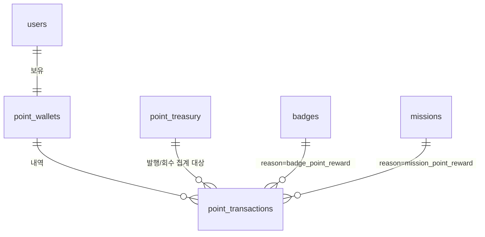

# JAM! Phase 12 데이터 모델 — 잼 포인트 시스템 (1a단계)

> 작성일: 2026-07-23
> 원칙: 잔액은 절대 직접 UPDATE하지 않는다. 모든 잔액 변화는 원장(`point_transactions`) 삽입과 함께, 하나의 DB 트랜잭션 안에서만 일어난다 (아래 §4 RPC).

---

## 1. 기존 테이블 (변경 없음, 재사용)

| 테이블 | 역할 | 비고 |
|--------|------|------|
| `missions` | 미션 마스터 | `reward_type`/`reward_points` 이미 존재(011) — 그대로 사용, 새 컬럼 없음 |
| `users` | 유저 마스터 | FK 대상으로만 사용 |
| `badges` | 배지 마스터 | §2에서 컬럼 1개 추가 |

## 2. 기존 테이블 변경

```sql
ALTER TABLE public.badges
  ADD COLUMN point_reward INTEGER NOT NULL DEFAULT 0 CHECK (point_reward >= 0);
COMMENT ON COLUMN public.badges.point_reward IS
  '이 배지가 발급될 때 함께 지급하는 잼 포인트. 0이면 포인트 없음. 배지 발급 후 값이 바뀌어도 이미 지급된 포인트는 소급 변경되지 않음(발급 시점 값으로 1회 지급).';
```

## 3. 신규 테이블 3개

### 3-1. `point_wallets` — 유저별 잔액 (캐시)

```sql
CREATE TABLE public.point_wallets (
  user_id UUID PRIMARY KEY REFERENCES public.users(id) ON DELETE CASCADE,
  balance INTEGER NOT NULL DEFAULT 0,
  updated_at TIMESTAMPTZ NOT NULL DEFAULT now()
);
-- 기존 유저 마이그레이션 없음 — lazy 생성 (첫 포인트 지급 시 upsert)
-- RLS: 본인 읽기, 쓰기 service_role (직접 UPDATE 경로 없음 — §4 RPC로만 변경)
```

### 3-2. `point_transactions` — 원장 (append-only)

```sql
CREATE TABLE public.point_transactions (
  id UUID PRIMARY KEY DEFAULT gen_random_uuid(),
  user_id UUID NOT NULL REFERENCES public.users(id) ON DELETE CASCADE,
  amount INTEGER NOT NULL CHECK (amount <> 0),           -- 양수=적립, 음수=차감
  reason TEXT NOT NULL CHECK (reason IN (
    'badge_point_reward',
    'mission_point_reward',
    'admin_grant',
    'admin_deduct'
    -- 1b단계 예약(이번엔 발급 안 함): 'sink_redemption'
    -- 2단계 예약(이번엔 발급 안 함): 'trade_sell', 'trade_buy'
  )),
  source_badge_id UUID REFERENCES public.badges(id),           -- reason='badge_point_reward'일 때만
  source_mission_id UUID REFERENCES public.missions(id),       -- reason='mission_point_reward'일 때만
  admin_reason_label TEXT,                                     -- reason='admin_grant'/'admin_deduct'일 때: 사유 목록 값 (예: 'cs_compensation') 또는 'other'
  admin_reason_note TEXT,                                      -- admin_reason_label='other'일 때만 자유 입력 텍스트
  created_at TIMESTAMPTZ NOT NULL DEFAULT now()
);
CREATE INDEX point_transactions_user_created_idx ON public.point_transactions (user_id, created_at DESC);
-- 수정/삭제 없음. 정정은 반대 부호의 새 행 추가로만.
-- RLS: 본인 읽기, 쓰기 service_role
```

### 3-3. `point_treasury` — 발행 장부 (싱글톤, 어드민 전용)

```sql
CREATE TABLE public.point_treasury (
  id INTEGER PRIMARY KEY DEFAULT 1 CHECK (id = 1),
  total_minted BIGINT NOT NULL DEFAULT 0,       -- 누계, 감소하지 않음
  total_reclaimed BIGINT NOT NULL DEFAULT 0,    -- 누계, 감소하지 않음
  updated_at TIMESTAMPTZ NOT NULL DEFAULT now()
);
INSERT INTO public.point_treasury (id) VALUES (1) ON CONFLICT (id) DO NOTHING;
-- 패턴: drop_policy/abusing_policy와 동일한 싱글톤
-- RLS: service_role만 접근 (일반 유저 read 불가 — 운영 전용 정보)
```

## 4. 잔액 변경의 유일한 경로 — `award_points()` RPC

**잔액을 직접 `UPDATE point_wallets SET balance = ...`로 바꾸는 코드는 어디에도 있으면 안 된다.** 캐시 잔액과 원장 합계가 어긋나는(§7 정합성 오류) 사고를 막기 위해, 잔액 변경은 아래 하나의 Postgres 함수를 통해서만 일어난다. 이 함수 안에서 ①원장 삽입 ②잔액 갱신 ③(적립계열이면) treasury.total_minted 증가 또는 (회수계열이면) total_reclaimed 증가가 **하나의 트랜잭션**으로 처리된다.

```sql
CREATE OR REPLACE FUNCTION public.award_points(
  p_user_id UUID,
  p_amount INTEGER,              -- 양수=적립, 음수=차감
  p_reason TEXT,
  p_source_badge_id UUID DEFAULT NULL,
  p_source_mission_id UUID DEFAULT NULL,
  p_admin_reason_label TEXT DEFAULT NULL,
  p_admin_reason_note TEXT DEFAULT NULL
) RETURNS public.point_transactions
LANGUAGE plpgsql SECURITY DEFINER AS $$
DECLARE
  v_tx public.point_transactions;
BEGIN
  INSERT INTO public.point_transactions
    (user_id, amount, reason, source_badge_id, source_mission_id, admin_reason_label, admin_reason_note)
  VALUES
    (p_user_id, p_amount, p_reason, p_source_badge_id, p_source_mission_id, p_admin_reason_label, p_admin_reason_note)
  RETURNING * INTO v_tx;

  INSERT INTO public.point_wallets (user_id, balance)
  VALUES (p_user_id, p_amount)
  ON CONFLICT (user_id) DO UPDATE
    SET balance = public.point_wallets.balance + p_amount, updated_at = now();

  IF p_amount > 0 THEN
    UPDATE public.point_treasury SET total_minted = total_minted + p_amount, updated_at = now() WHERE id = 1;
  ELSE
    UPDATE public.point_treasury SET total_reclaimed = total_reclaimed + (-p_amount), updated_at = now() WHERE id = 1;
  END IF;

  RETURN v_tx;
END;
$$;
```

- 애플리케이션 코드(`src/lib/points/`)는 이 RPC를 감싸는 얇은 헬퍼(`awardPoints(...)`)만 두고, 직접 INSERT/UPDATE를 흩어놓지 않는다.
- `SECURITY DEFINER`로 두는 이유: 클라이언트가 아니라 서버(service role) 경로에서만 호출되므로, RLS를 우회해 잔액·장부를 원자적으로 갱신할 권한이 필요.

## 5. 정합성 규칙 (도메인 불변식)

```
모든 유저의 point_wallets.balance 합계
  = point_treasury.total_minted − point_treasury.total_reclaimed
  = 모든 point_transactions.amount의 합
```

세 값 중 하나라도 어긋나면 원장 버그다. `/admin/points`(Phase12_03 Step D)는 이 세 값을 매번 비교해서 어긋나면 경고 배너를 띄운다 — 코드로 막아도 운영 중 수작업 실수(RPC 우회한 직접 SQL 실행 등)가 있을 수 있으므로 감시용 체크는 남겨둔다.

## 6. 관계 요약



## 7. 시드

- `point_treasury`: 싱글톤 1행만 삽입 (기본값 0/0)
- `badges.point_reward`: 기존 배지 전량 기본값 0으로 채워짐(ALTER 시 DEFAULT 0) — **소급 지급 없음**이므로 기존 배지에 값을 채워 넣는 데이터 시드는 하지 않는다. 어드민이 배지 에디터에서 개별적으로 설정.
